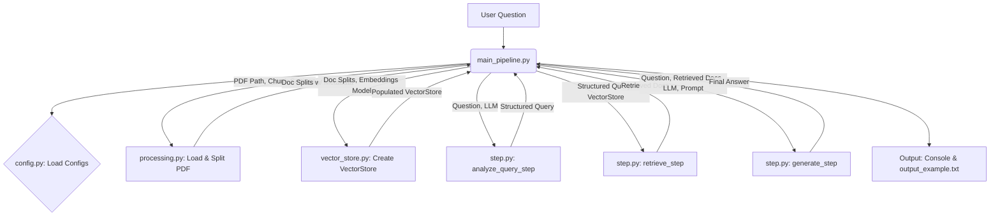

# Part 1: Basic RAG Pipeline Implementation

This part contains a Python implementation of a minimal Retrieval-Augmented Generation (RAG) pipeline. The pipeline processes a PDF document, allows querying against its content, and generates answers based on retrieved information.

## Features and workflow

*   Loads and splits PDF documents into manageable chunks.
*   Adds sectional metadata to document chunks for potential targeted retrieval.
*   Creates an in-memory vector store using OpenAI embeddings.
*   Analyzes user queries to form structured search objects.
*   Retrieves relevant document chunks based on the query.
*   Generates answers using an OpenAI LLM, augmented with the retrieved context.
*   Configuration managed via a `.env` file and `config.py`.

> **Note:** The Mermaid diagram below is best viewed on platforms that support it, such as GitHub.



## Workflow

part1_rag_pipeline/       # Main directory for the RAG pipeline implementation
├── pipeline.py           # Main script to run the RAG pipeline
├── step.py               # Core RAG steps: query analysis, retrieval, generation
├── processing.py         # PDF loading, splitting, and metadata addition
├── vector_store.py       # Vector store creation and population
├── state_search.py       # TypedDict definitions for structured search
├── config.py             # Configuration management (API keys, paths, model names)
├── data/                 # Directory for input data files
│   └── publication.pdf   # Input PDF document (ensure this exists or adjust path)
├── .env.example          # Example environment file template
├── requirements.txt      # Python dependencies (you need to create this)
└── output_example.txt    # Example output file from a pipeline run
└── PART1.md             # Part1 documentation file

## Setup and Installation

1.  **Clone the repository:**
    ```bash
    git clone <your-repository-url>
    cd <your-repository-name>/part1_rag_pipeline
    ```


2.  **Install dependencies:**
    ```bash
    pip install -r requirements.txt 
    ```
    *(You will need to create a `requirements.txt` file. Based on your code, it would likely include `langchain`, `langchain-openai`, `pypdf`, `python-dotenv`)*

3.  **Set up Environment Variables:**
    *   Create a `.env` file in the `part1_rag_pipeline` directory by copying `.env_example` (you should create this example file).
    *   Add your OpenAI API key to the `.env` file:
        ```env
        LLM_API_KEY_ENV="your_openai_api_key_here"
        # Optional LangSmith keys
        # LANGSMITH_API_KEY="your_langsmith_api_key"
        # LANGSMITH_TRACING_V2="true" 
        # LANGSMITH_PROJECT="your_project_name"
        ```

## Running the Pipeline

To run the RAG pipeline with the test question, execute the `pipeline.py` script:

```bash
python pipeline.py

