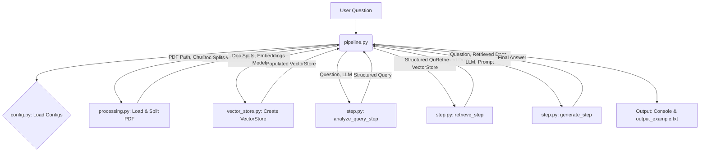

# Part 1 - Basic RAG Pipeline Implementation

This part contains a Python implementation of a minimal Retrieval-Augmented Generation (RAG) pipeline. The pipeline processes a PDF document, allows querying against its content, and generates answer based on retrieved information.

## Features and workflow

*   Loads and splits PDF documents into manageable chunks.
*   Adds sectional metadata to document chunks for potential targeted retrieval.
*   Creates an in-memory vector store using OpenAI embeddings.
*   Analyzes user queries to form structured search objects.
*   Retrieves relevant document chunks based on the query.
*   Generates answers using an OpenAI LLM, augmented with the retrieved context.
*   Configuration managed via a `.env` file and `config.py`.

> **Note:** The Mermaid diagram below is best viewed on platforms that support it, such as GitHub.


### How to Read the Diagram:

1. **Flow Direction**: The diagram flows **left to right**, with each node representing a step in the pipeline. The arrows indicate the flow of data between these steps.

2. **Nodes Representing Steps**:
   - Each box (node) represents a single operation or action. For instance, `A[User Question]` represents receiving the user's question, and `B(pipeline.py)` represents the script `pipeline.py` where the processing begins.

3. **Arrows Represent Data Flow**:
   - Arrows (`-->`) show the direction of data flow. For example, `A[User Question] --> B(pipeline.py)` indicates that the **User Question** flows into **pipeline.py** for processing.

4. **Decision Points**:
   - **Decision points** or branching in the pipeline are shown as **diamond-shaped nodes**. For instance, in the diagram, the node `C{config.py: Load Configs}` represents a decision point where the pipeline determines whether to load configuration settings. When rendered, these decision points will appear as diamond shapes, and the associated label (`config.py: Load Configs`) won’t be visible, only the shape itself.

5. **Final Output**:
   - The final node shows where the output is produced or stored. In this case, `I[Output: Console & output_example.txt]` indicates that the results of the pipeline are saved to an output file or printed to the console.


## Part 1 project structure

```txt
PART1_RAG_IMPLEMENTATION/       # Main directory for the RAG pipeline implementation
├── .env.example          # Example environment file template
├── PART1.md              # Part1 documentation file
├── config.py             # Configuration management (API keys, paths, model names)
├── data/                 # Directory for input data files
│   └── publication.pdf   # Input PDF document
├── output_example.txt    # Example output file from a pipeline run
├── pipeline.py           # Main script to run the RAG pipeline
├── processing.py         # PDF loading, splitting, and metadata addition
├── requirements.txt      # Python dependencies
├── search.py             # TypedDict definitions for structured search
├── step.py               # Core RAG steps: query analysis, retrieval, generation
└── vector_store.py       # Vector store creation and population 
```

## Setup and Installation


1.  **Install dependencies:**
    ```bash
    pip install -r requirements.txt 
    ```

2.  **Set up Environment Variables:**
    *   Create a `.env` file in the `PART1_RAG_IMPLEMENTATION` directory by copying `.env.example`
    *   Add your OpenAI API key to the `.env` file:
        ```env
        LLM_API_KEY_ENV="your_openai_api_key_here"
        # Optional LangSmith keys
        # LANGSMITH_API_KEY="your_langsmith_api_key"
        # LANGSMITH_TRACING_V2="true" 
        # LANGSMITH_PROJECT="your_project_name"
        ```

## Running the Pipeline

To run the RAG pipeline with the test question, execute the `pipeline.py` script:

```bash
python pipeline.py

