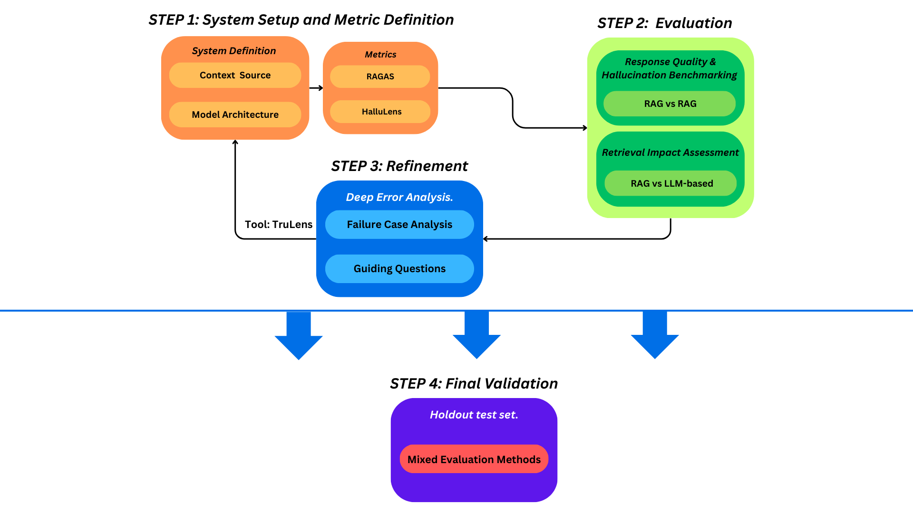

# Part 2 – Evaluation Methodology

To evaluate RAG response quality, I propose a four-step iterative pipeline, largely adapted from the methodology presented by Simon et al. [1].

---

My methodology begins with **(1) System Definition & Metric Selection**: We define each RAG variant by its context sources (e.g., external web, internal documents) and core architectural components (embeddings, retriever, LLM), critical for comparative analysis. We then select a robust suite of metrics: Answer Relevance (AR), Context Relevance (CR), and Faithfulness (FF) from RAGAS [2] to cover core quality aspects, complemented by specific hallucination metrics from the HalluLens benchmark [3] to analyze error typologies like extrinsic, intrinsic, and factuality.

**Next (2) is a Multi-faceted Quantitative Evaluation**: (a) To isolate the retrieval component's contribution, we conduct a **Retrieval Impact Assessment**, comparing RAG AR against a non-RAG (pure LLM) baseline. A significant AR improvement for RAG here quantifies the added value of contextual retrieval in enhancing answer pertinence. (b) We then perform **Response Quality & Hallucination Benchmarking** across different RAG configurations. HalluLens is employed to benchmark hallucination severity, analyzing its specific error types, while RAGAS evaluates FF and CR to assess factual grounding and contextual pertinence. This dual analysis helps determine if retrieved context genuinely reduces hallucinations or if unsupported content (due to inadequate or misleading context) still persists, guiding the selection of more promising configurations.

**The third step (3) involves Iterative Refinement via Deep Error Analysis**: We systematically log all key metrics (AR, CR, FF, hallucination) across successive RAG iterations, potentially using tools like TruLens[^TF] for enhanced observability and tracking of performance trends. The cornerstone of this phase is a meticulous failure analysis. This combines automated scores with targeted, deep manual qualitative reviews—where human evaluators scrutinize problematic responses, assessing aspects like context utilization, underlying information needs, and task clarity for the LLM. This process uncovers error patterns and their root causes, generating actionable insights that directly guide specific, iterative adjustments to RAG components (e.g., retriever algorithms, prompt strategies, or data source augmentation) aiming for robust improvements.

**Finally (4), Final Validation** is conducted. Once iterative refinements yield an optimized RAG system, we validate its performance on a dedicated, previously unseen holdout test set to ensure an unbiased assessment of its generalization capabilities. We employ a combination of the established automated metrics and thorough human review to objectively confirm its overall quality, make a final selection of the best-performing configuration, and report on its expected real-world efficacy. This entire iterative process ensures a comprehensive and reliable assessment, leading to more trustworthy RAG responses.

---

Through these four steps - definition, evaluation, iterative refinement, and validation - we can systematically assess and improve the quality of RAG responses.

---

## Proposed Evaluation Pipeline Illustration

---

## References

[1] Simon, S., Mailach, A., Dorn, J., & Siegmund, N. (2024). *A Methodology for Evaluating RAG Systems: A Case Study On Configuration Dependency Validation*. arXiv preprint arXiv:2401.08801. Available at: \url{https://arxiv.org/abs/2401.08801}

[2] Es, S., James, J., Espinosa Anke, L., & Schockaert, S. (2024). Ragas: Automated evaluation of retrieval augmented generation. In *Proceedings of the 18th Conference of the European Chapter of the Association for Computational Linguistics: System Demonstrations* (pp. 150–158).

[3] Bang, Y., Ji, Z., Schelten, A., Hartshorn, A., Fowler, T., Zhang, C., Cancedda, N., & Fung, P. (2025). *HalluLens: LLM Hallucination Benchmark*. arXiv preprint arXiv:2504.17550.

[^TF]: TruLens - Open-source library for LLM Observability. More information available at: \url{https://www.trulens.org/}
